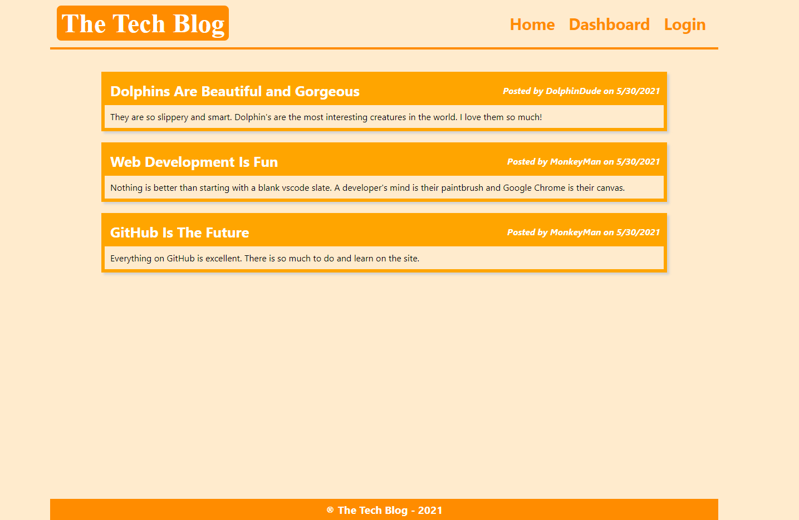

# The Tech Blog

## Description
The Tech Blog is a social site where users can create blog posts for the tech community. Create an account and login to begin posting. Users can comment on other blog posts to provide commentary and feedback to other authors. Blog posts can be deleted or updated as well.

## Table of Contents

* [Installation](#Installation)
* [Usage](#Usage)
* [License](#License)
* [Questions](#Questions)
* [Credits](#Credits)

## Installation
No installation required. Go to https://the-tech-blog-17676761123.herokuapp.com/ to begin using The Tech Blog.

## Usage
Create an account on the login page. Follow instructions on the dashboard page to create posts. From your dashboard, click on your posts to edit or delete them. From the homepage, you can view all posts on the site. Click a post to leave a comment. You will be signed out of your account after 5 mins of inactivity.

## License
MIT License

## Questions
You may contact the project author via:
* Email: seanbrent5@live.ca
* GitHub: [Brentsa](https://github.com/Brentsa)

## Credits
Sean Brent